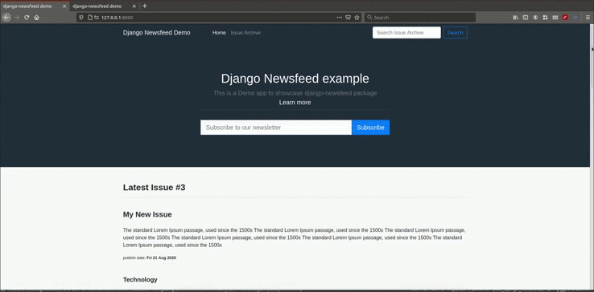

django-newsfeed example project
============================

This is a example project created using the `django-newsfeed package`_.
This example project overrides the templates to use bootstrap.
It also uses celery to handle newsletter delivey to the subscribers.

.. _django-newsfeed package: https://github.com/saadmk11/django-newsfeed

What is django-newsfeed?
========================

`django-newsfeed`_ is a news curator and newsletter subscription package for django.
It can be used to create a news curator website which sends newsletters to
their subscribers also it can be used to add a news subscription section to your website.

checkout the package `here`_

.. _here: https://github.com/saadmk11/django-newsfeed
.. _django-newsfeed: https://github.com/saadmk11/django-newsfeed

Handle Sending newsletter using a task queue
============================================

In this Example project we use ``celery``, ``celery-beat`` and ``redis`` to
send emails in the background.

Gist of the project:

Celery Task
-----------

.. code-block:: python

    from celery.decorators import task

    from newsfeed.models import Newsletter
    from newsfeed.utils.send_newsletters import send_email_newsletter

    @task(name="send_email_newsletter_task")
    def send_email_newsletter_task(newsletters_ids=None, respect_schedule=True):
        newsletters = None

        if newsletters_ids:
            newsletters = Newsletter.objects.filter(
                id__in=newsletters_ids
            )
        send_email_newsletter(
            newsletters=newsletters,
            respect_schedule=respect_schedule
        )

Celery Schedule
---------------

.. code-block:: python

    app.conf.beat_schedule = {
        'send_email_newsletter': {
            'task': 'send_email_newsletter_task',
            # http://docs.celeryproject.org/en/latest/userguide/periodic-tasks.html
            'schedule': crontab(minute=0, hour='*'),
        }
    }

Admin Action override
---------------------

.. code-block:: python

    from django.contrib import admin, messages

    from newsfeed.admin import NewsletterAdmin
    from newsfeed.models import Newsletter

    from .tasks import send_email_newsletter_task

    admin.site.unregister(Newsletter)

    @admin.register(Newsletter)
    class NewsletterAdmin(NewsletterAdmin):

        def send_newsletters(self, request, queryset):
            newsletter_ids = list(queryset.values_list('id', flat=True))

            send_email_newsletter_task.delay(
                newsletters_ids=newsletter_ids,
                respect_schedule=False
            )
            messages.add_message(
                request,
                messages.SUCCESS,
                'Sending selected newsletters(s) to the subscribers',
            )
Application Gif:
----------------

